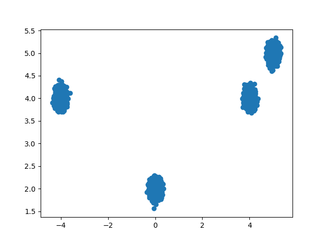
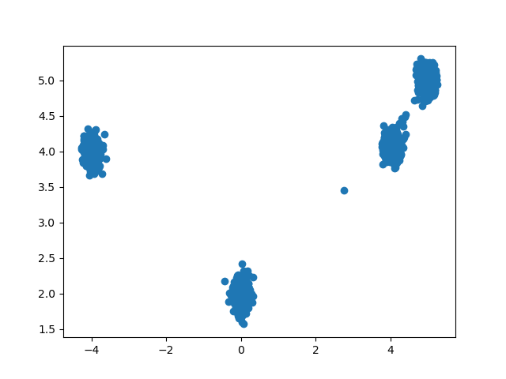

Experiments with score-based generative models and Gaussian distributions.

# Train 
```bash
python3 train.py --config configs/mixture-8196-vp.yml
```

Example (Data Distribution):



Example (Samples from model):



# Inverse Problems

