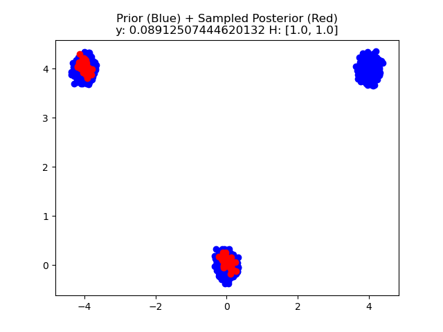

Experiments with score-based generative models and Gaussian distributions. Code partially based on [this repository](https://github.com/devzhk/InfSBM/tree/master).

# Train 
```bash
python3 train.py --config configs/mixture-8196-vp.yml
```

Example (Samples from model):


# Inverse Problems
 
```bash
python3 pigdm.py --config configs/pigdm-mixture-8196-ve.yml
```

```bash
python3 mcmc.py --config configs/mcmc-mixture-8196-vp.yml
```

Given prior distribution on data **x** and forward operator **H** and measurement data _y_ = **Hx** + _z_, 
where _z_ is Gaussian noise, we compute samples from the posterior distribution _p_(**x** | _y_) with our pCN-Diffusion algorithm.



