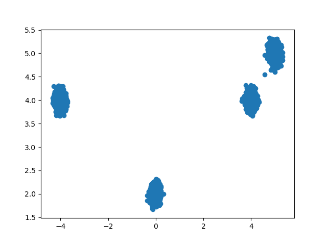

Experiments with score-based generative models and Gaussian distributions.

# Train 
```bash
python3 train.py --config configs/mixture-8196-vp.yml
```

Example (Samples from model):



# Inverse Problems

Given prior distribution on data **x** and forward operator **H** and measurement data _y_ = **Hx** + _z_, 
where _z_ is Gaussian noise, we compute samples from the posterior distribution _p_(**x** | __y__).


